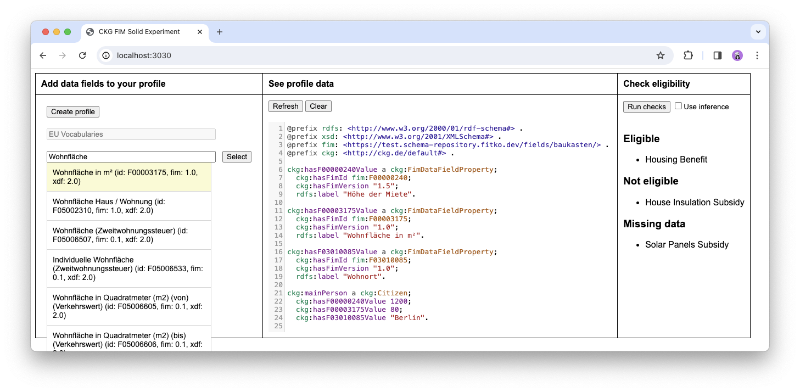

# CKG FIM Solid Experiment

This was my final project in the [Linked Data & Solid](https://www.ugain.ugent.be/LDS2023.htm) course of the Uni Ghent, presented on 2024-01-11.
- 🗒️ [Project abstract](project-abstract.md)
- 🖼️ [Poster](Poster.pdf)
- 📺 [Walkthrough video](https://www.youtube.com/watch?v=E9A5CuIhi58&list=PLyt46q60EbD_mT4BPbkHtHCaWCOCX-PlP&index=3) (20 min) of this prototype

> Congrats! You won the best poster award of this year’s VAIA/UGain course!
> The jury was particularly convinced by the compelling pitch that showed
> multiple benefits of using Linked Data technologies in your solution.




## Setup

```sh
node fim.js # comment methods at the bottom in or out as needed
```

Start the Community Solid Server:

```shell
npm run solid
```

At first start, go to `localhost:3000` in the browser and:
- *Sign up for an account* ...
- *Create pod*, name it **ckg-pod**

## Run

Same command as above to start Solid.
```shell
npm start # starts the express server at localhost:3030
```

You may check your pod content using [penny.vincenttunru.com](https://penny.vincenttunru.com) or your local file system.
